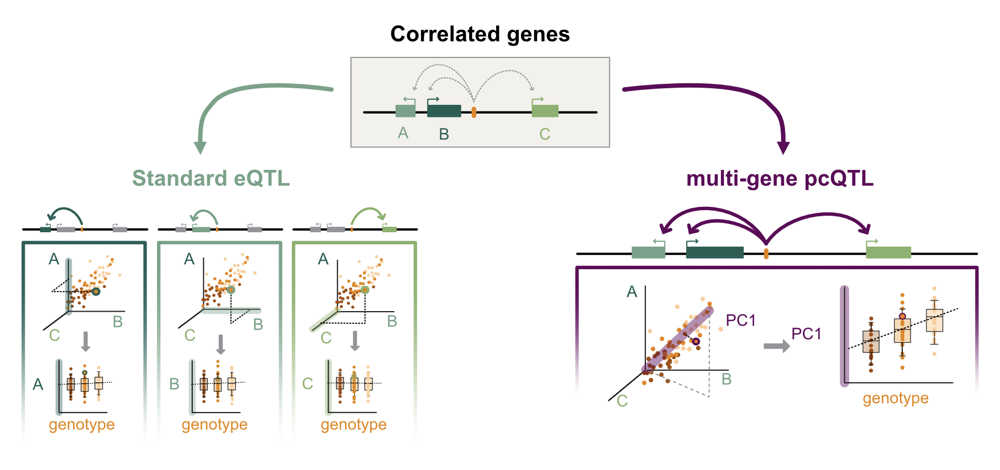

# Focus on single gene effects limits discovery and interpretation of complex trait-associated variants

## Overview

This repository contains the code associated with our research on allelic expression "proxitropy" and the development of a multi-gene eQTL mapping framework, termed cis-principal component expression QTL (cis-pc eQTL or pcQTL). Our study investigates how a single variant can influence the expression of multiple neighboring genes, providing insights into gene regulation and complex trait-associated variation.

---

## Preprint

Our preprint is available [here](https://www.biorxiv.org/content/10.1101/2025.06.06.658175v1)

## Usage

Please note that this repository is not currently available as a standalone tool. Instead, we recommend utilizing a built-in principal component caller for your analysis needs. For instance, if you are using Python, you can use `scikit-learn` to calculate principal components. 

## Data availibility 

* Clusters and summary stats for pcQTLs are available [here](https://doi.org/10.5281/zenodo.15605351).  
* All processed GTEx data are available via [GTEx portal](https://www.gtexportal.org/home/downloads/adult-gtex). 
* GWAS summary stats are available [here](https://zenodo.org/records/3629742#.Y9rTQOzMIUF).

#### Annotation data

* Paralog and GO terms are available on [biomart](https://www.ensembl.org/info/data/biomart/index.html)
* CTCF peaks are available on the [ENCODE portal](https://www.encodeproject.org/)
* TAD boundaries are available on [TADKB](http://dna.cs.miami.edu/TADKB/).
* ABC predictions across cell types are available from the [Engreitz lab website](https://www.engreitzlab.org/resources).
* cCREs are available from [SCREEN](https://screen.encodeproject.org/).

## Repository structure

* `workflow/rules`: Snakemake workflow for the pcQTL mapping framework.
* `workflow/figures`: Jupyter notebooks for data analysis and visualization and figure files.

## Acknowledgments
We thank the donors and their families for their generous gifts of biospecimens to the GTEx research project. The Genotype-Tissue Expression (GTEx) project was supported by the Common Fund of the Office of the Director of the National Institutes of Health (http://commonfund.nih.gov/GTEx). Additional funds were provided by the National Cancer Institute (NCI), National Human Genome Research Institute (NHGRI), National Heart, Lung, and Blood Institute (NHLBI), National Institute on Drug Abuse (NIDA), National Institute of Mental Health (NIMH), and National Institute of Neurological Disorders and Stroke (NINDS). This research was supported by National Institutes of Health grants R01MH12524, U01AG072573, U01HG012069 to S.B.M. K.L. is supported by the Stanford Genome Training Program (SGTP; NIH/NHGRI T32HG000044). T.G. is supported by the Knight-Hennessy Scholars fellowship

